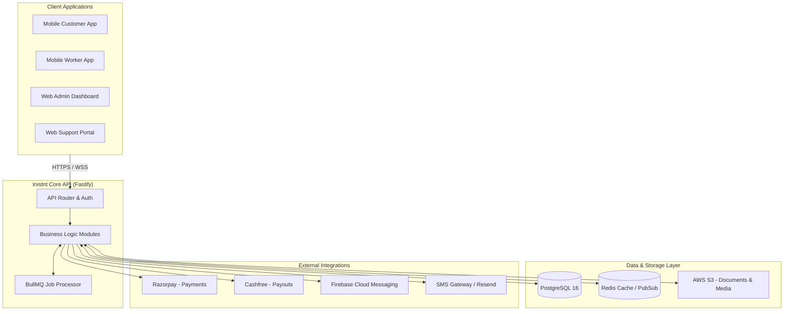
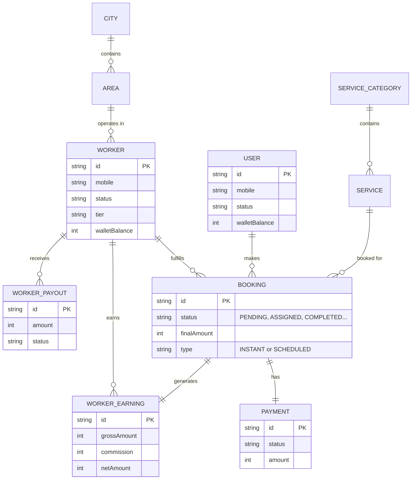
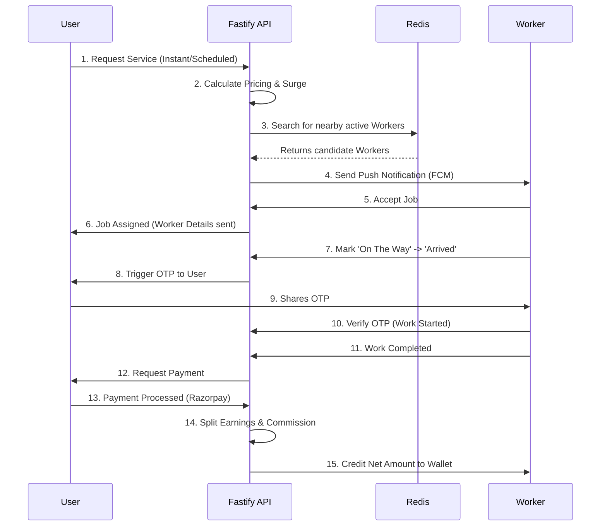
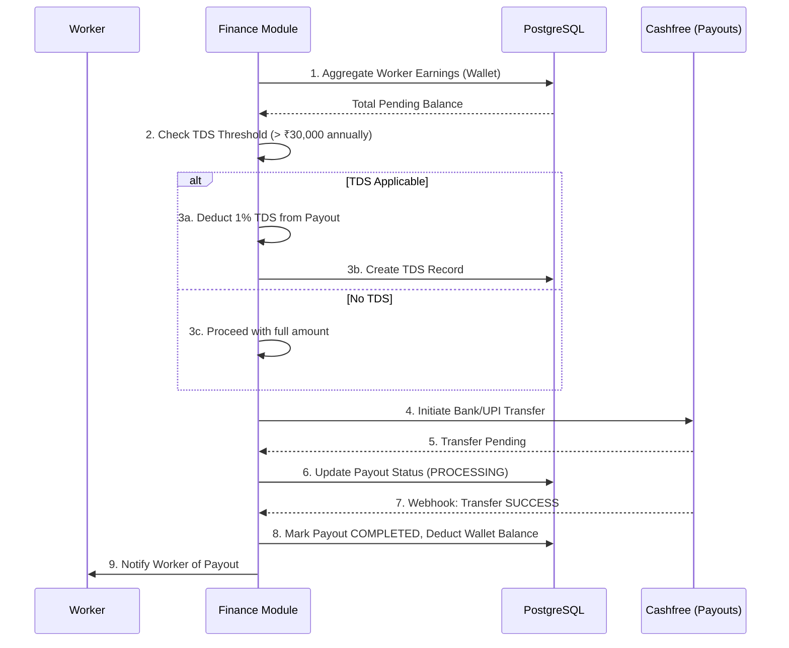

  <h1>🚀 Inistnt Platform Architecture & SRS</h1>
  
<strong>Comprehensive Software Requirements Specification, Architecture, and Dataflow Documentation</strong>

---

## 📖 1. Executive Summary

**Inistnt** is a scalable, on-demand gig-worker platform designed to seamlessly connect customers with verified service professionals. Built with modern web technologies, the platform handles end-to-end service lifecycles including **instant/scheduled booking matching, live worker tracking, complex commission logic, tax deductions (TDS), and automated wallet payouts**.

The project is structured as a **Turborepo Monorepo** encompassing multiple client applications backed by a high-performance **Fastify + Prisma API**.

---

## 🏗️ 2. Monorepo Structure & Tech Stack

### 📂 Workspaces
- **`apps/mobile-customer`**: React Native / Expo app for end-users to book services.
- **`apps/mobile-worker`**: React Native / Expo app for gig-workers to accept jobs and track earnings.
- **`apps/web-admin`**: React/Next.js dashboard for platform administrators and managers.
- **`apps/web-customer`**: Consumer-facing web portal for booking and tracking.
- **`apps/web-support`**: Internal tool for support agents to handle tickets, SOS incidents, and disputes.
- **`services/api`**: The core Fastify backend service powering the entire platform.
- **`packages/*`**: Shared libraries including `api-client`, `ui`, `validators`, `constants`, and `types`.

### ⚙️ Core Technology Stack
- **Backend Framework**: [Fastify](https://www.fastify.io/)
- **Database ORM**: [Prisma](https://www.prisma.io/)
- **Primary Database**: PostgreSQL 16
- **Caching & Live Data**: Redis (ioredis)
- **Analytics (Optional)**: ClickHouse & Elasticsearch
- **Payments & Payouts**: Razorpay (Collection), Cashfree (Payouts)
- **Queues & Background Jobs**: BullMQ & KafkaJS

---

## 📊 3. High-Level System Architecture

The following diagram illustrates how the client applications communicate with the backend services and external providers.

---

## 🗄️ 4. Core Database Structure (ER Diagram)

The database schema is highly normalized and partitioned by domains: **Identity, Geography, Catalog, Operations, and Finance**. Below is a simplified Entity-Relationship mapping of the core business models.

---

## 🔄 5. Key System Flows

### A. The Booking Lifecycle Dataflow
This flow describes the core operation of the platform: how a user books a service and how a worker fulfills it.

### B. Worker Finance & TDS Payout Flow
This flow details how worker earnings are accumulated, how TDS (Tax Deducted at Source) is calculated for compliance, and how payouts are disbursed.

---

## 🧩 6. Backend Modules Breakdown

The `services/api/src/modules/` directory contains isolated domains representing the platform's features:

1. **`auth/`**: OTP-based login, JWT generation, session management, and RBAC (Role-Based Access Control) for Staff.
2. **`bookings/`**: The core state machine handling the transition of a job from `PENDING` to `COMPLETED`.
3. **`payments/` & `payout/`**: Razorpay integrations for collecting customer funds, and Cashfree integrations for disbursing funds to workers. Handles wallet balances, commissions, and refunds.
4. **`workers/`**: Worker lifecycle management including onboarding, document verification (Aadhaar/PAN), TDS calculation, skills mapping, and uniform checks.
5. **`tracking/`**: Live geolocation tracking using Redis to match users with nearby gig workers based on polygons and radius calculations.
6. **`admin/` & `superadmin/`**: CMS capabilities for feature flags, banners, commission rule configurations, and surge pricing modifications.
7. **`geography/`**: Hierarchical management of States -> Cities -> Areas -> Surge Zones.
8. **`reviews/` & `support/`**: Customer feedback loops, SOS incidents, dispute handling, and chat features.
9. **`coupons/` & `referral/`**: Growth mechanics managing discounts, wallet cashbacks, and referral tree bonuses.

---

## 🔒 7. Compliance & Security (Important Features)

- **Worker Verification:** Mandatory Aadhaar, PAN, and Police Verification document tracking before activation.
- **TDS Compliance (Section 194C):** Automatic 1% tax deduction tracking for workers whose annual aggregate payout exceeds ₹30,000.
- **Fraud Detection:** Automated flagging for location spoofing, rapid cancellations, fake selfies, and review manipulation.
- **Data Encryption:** Sensitive banking details (Account No, IFSC) and identity strings are securely encrypted at rest.
- **SOS Incident Management:** Immediate escalation queues for emergencies reported by users or workers during an active gig.
