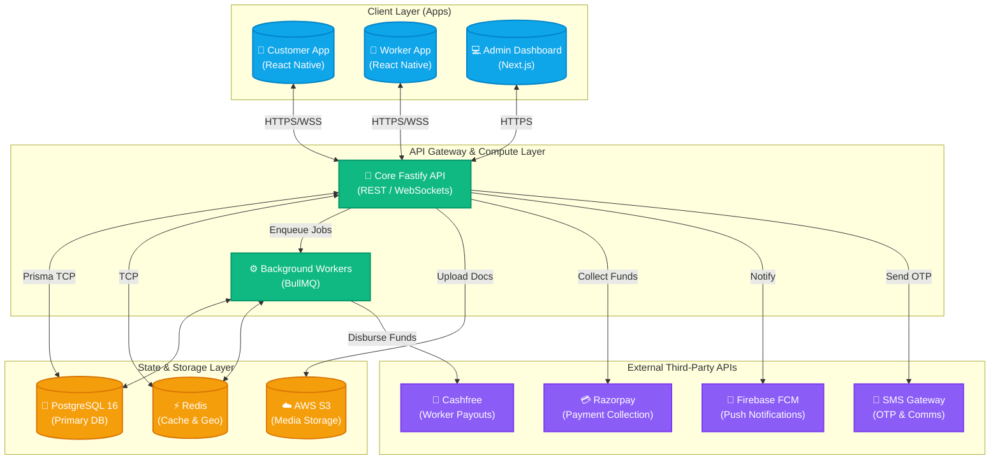
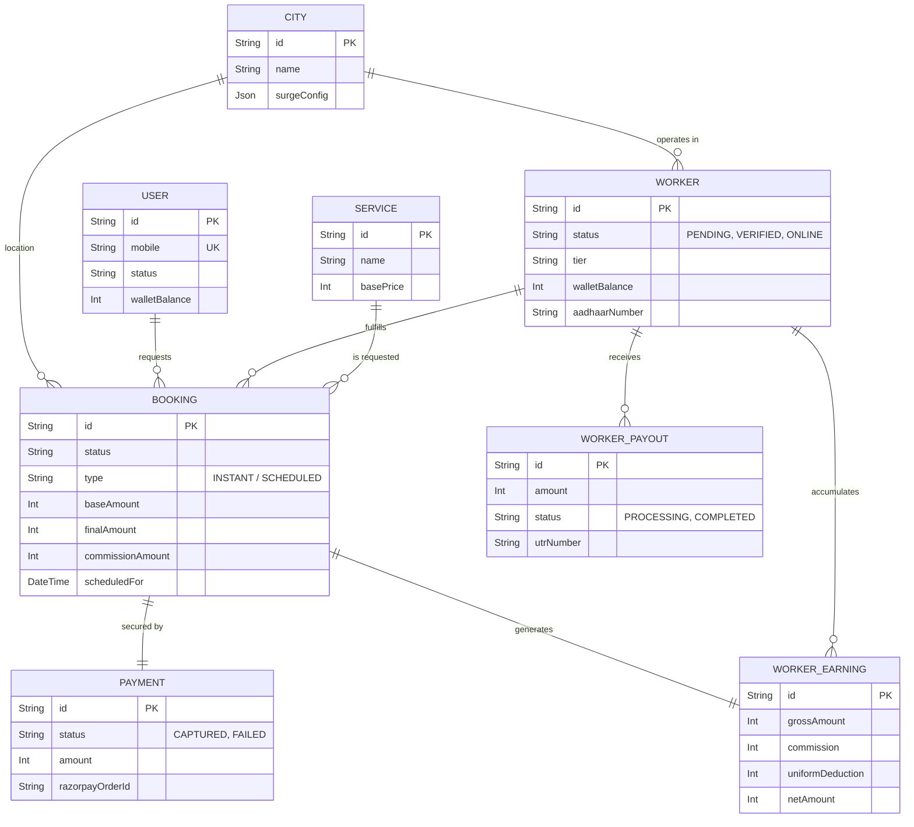
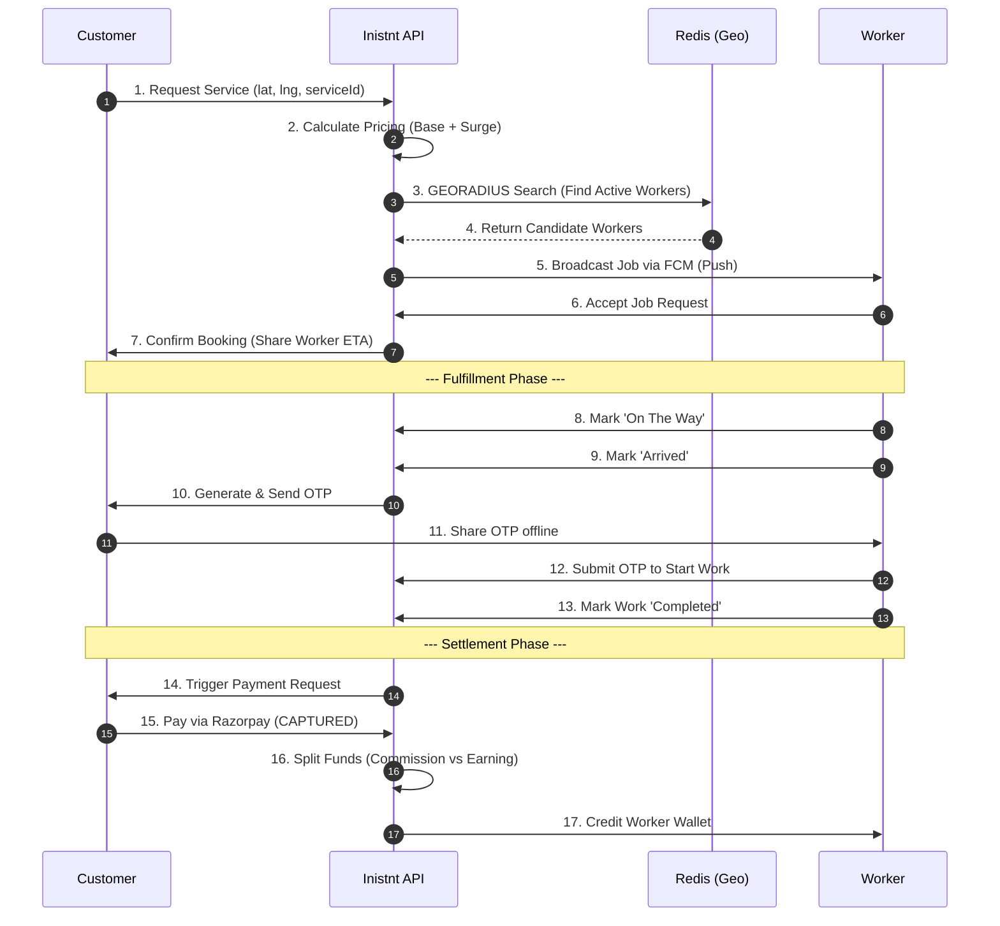
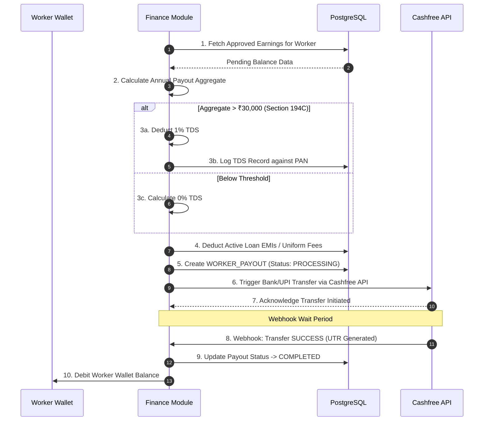

<!-- Please save the logo you uploaded to the root of your project as 'logo.png' (or 'docs/logo.png') so the image tag below can render it! -->

<div align="center">
  

  <h1>🚀 Inistnt — The On-Demand Gig Economy Platform</h1>
  
  <p><strong>A hyper-scalable, full-stack monorepo for matching customers with verified service professionals in real-time.</strong></p>

  <!-- Shields/Badges -->
  <p>
    
    
    
    
    
  </p>
</div>

---

## 📋 Table of Contents
1. [Platform Overview](#-platform-overview)
2. [Key Features](#-key-features)
3. [Monorepo Architecture](#-monorepo-architecture)
4. [System Architecture (C4 Model)](#-system-architecture-c4-model)
5. [Database Schema (ER Diagram)](#-database-schema-er-diagram)
6. [Core Business Flows](#-core-business-flows)
    - [Booking & Fulfillment Lifecycle](#a-booking--fulfillment-lifecycle)
    - [Financial Engine & TDS Payouts](#b-financial-engine--tds-payouts)
7. [Tech Stack Details](#-tech-stack-details)
8. [Local Development](#-local-development)

---

## 🌍 Platform Overview

**Inistnt** is an industry-grade platform designed to revolutionize the home and gig-services industry. By utilizing high-frequency geo-spatial matching, secure automated payments, and strict compliance monitoring (e.g., automated TDS deductions, identity verification), Inistnt provides a frictionless experience for both **Customers** (seeking services) and **Workers** (seeking earning opportunities).

---

## ✨ Key Features

| 🧑‍💼 For Customers | 🛠️ For Workers | 🛡️ For Administrators |
| :--- | :--- | :--- |
| **Instant & Scheduled Bookings** | **Live Job Radar** via Redis Geo-hashing | **Dynamic Surge Pricing** Control |
| **Real-time Tracking** of Worker ETA | **Automated Payouts** (Cashfree API) | **Commission Rule Engine** |
| **Secure OTP Verification** for job start | **Digital Wallets & Earnings Ledger** | **Fraud & Anomaly Detection** |
| **Seamless Payments** via Razorpay | **TDS Tax Compliance Automation** | **Worker Compliance Management** |
| **Multi-tier Service Catalogs** | **Loyalty & Reward Programs** | **Dispute & SOS Escalations** |

---

## 🏗️ Monorepo Architecture

The project is structured as a **Turborepo** to maximize code-sharing, ensure strict type safety across the stack, and accelerate build times.

```bash
inistnt/
├── apps/
│   ├── mobile-customer/  # React Native (Expo) app for end-users
│   ├── mobile-worker/    # React Native (Expo) app for gig workers
│   ├── web-customer/     # Next.js consumer web portal
│   ├── web-admin/        # Next.js CMS & operations dashboard
│   └── web-support/      # Internal portal for ticket/SOS resolution
├── services/
│   └── api/              # Core Fastify API (Business Logic, DB, Auth)
└── packages/
    ├── api-client/       # Shared Axios/tRPC client definitions
    ├── constants/        # Shared enums, configs, and mappings
    ├── types/            # Shared TypeScript interfaces
    ├── ui/               # Shared React UI components (Design System)
    └── validators/       # Zod schemas for cross-stack validation
```

---

## 🧩 System Architecture (C4 Model)

The following diagram represents the Container-level architecture of the Inistnt platform, showcasing how user-facing interfaces interact with backend services, databases, and external providers.



---

## 🗄️ Database Schema (ER Diagram)

The database is heavily normalized to ensure data integrity across complex financial and operational boundaries.



---

## 🔄 Core Business Flows

### A. Booking & Fulfillment Lifecycle
A highly resilient state machine tracks every gig from search to completion.



### B. Financial Engine & TDS Payouts
Ensuring strict tax compliance and automated fund disbursement.



---

## 🛠️ Tech Stack Details

| Domain | Technology | Purpose |
| :--- | :--- | :--- |
| **API Server** | Node.js + Fastify | High-throughput, low-latency REST & WebSocket server. |
| **Database ORM** | Prisma | Strongly typed database client and schema migrations. |
| **Primary DB** | PostgreSQL 16 | Relational data, ACID transactions, and robust constraints. |
| **Caching/State** | Redis (ioredis) | Session management, rate limiting, and fast Geo-spatial queries. |
| **Background Jobs** | BullMQ | Asynchronous tasks (webhook processing, bulk notifications). |
| **Monorepo Tools** | Turborepo, pnpm | Fast builds, dependency linking, and caching. |
| **Mobile Apps** | React Native + Expo | Cross-platform (iOS/Android) unified UI development. |
| **Web Apps** | React + Next.js | SEO-friendly consumer web and fast CMS dashboards. |

---

## 🚀 Local Development

Follow these steps to get the platform running on your local machine.

### Prerequisites
- Node.js (v20+)
- pnpm (v8+)
- Docker & Docker Compose (for Postgres and Redis)

### Installation

1. **Clone the repository:**
   ```bash
   git clone https://github.com/inistnt/inistnt.git
   cd inistnt
   ```

2. **Install Dependencies (from workspace root):**
   ```bash
   pnpm install
   ```

3. **Start Infrastructure (Databases):**
   ```bash
   # Starts PostgreSQL and Redis containers
   docker-compose up -d
   ```

4. **Environment Variables:**
   ```bash
   # Copy the example environments
   cp services/api/env.example services/api/.env
   # Ensure DATABASE_URL and REDIS_URL point to your local docker containers
   ```

5. **Database Setup:**
   ```bash
   cd services/api
   pnpm run db:generate
   pnpm run db:migrate
   pnpm run db:seed  # Optional: Loads dummy catalog & users
   ```

6. **Start the Development Servers:**
   ```bash
   # Go back to root and start Turborepo
   cd ../../
   pnpm dev
   ```
   *This command will spin up the Fastify API, Admin Web, and Mobile bundlers simultaneously.*

---

<div align="center">
  <p>Built with ❤️ by the <strong>Inistnt Engineering Team</strong>.</p>
</div>
